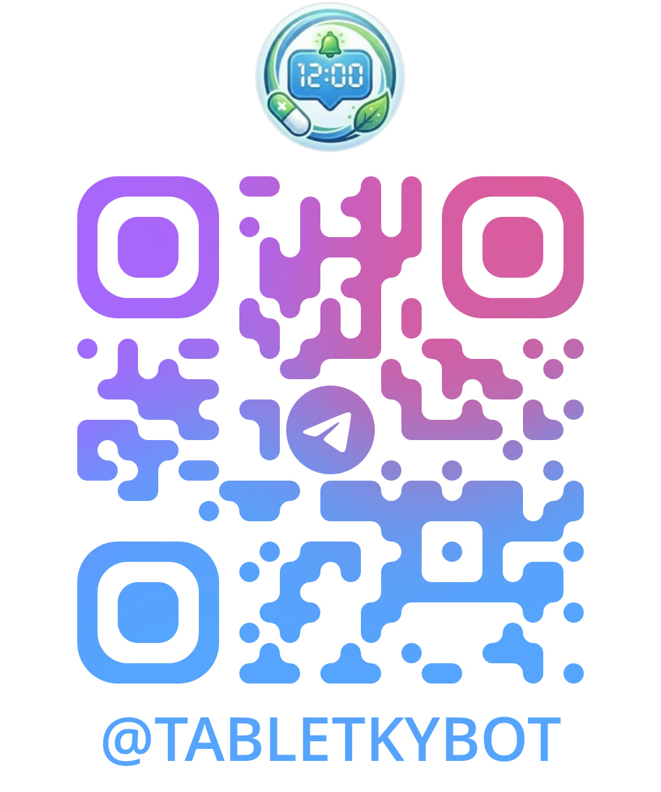

# MedBot – AI-Powered Medication & Prescription Management Telegram Bot

A production-ready Telegram bot for medication schedule and prescription management, built with Python and aiogram 3. Features a full **function-calling AI agent** (powered by NVIDIA NIM, Llama models) that can read, add, update, and remove the user's medicines and prescriptions directly from a chat conversation — not just answer questions about them. Deployed on Oracle Cloud with a webhook architecture, Docker Compose orchestration, persistent Redis-backed reminders, automated database backups, and a web-based admin panel.

> Bachelor's Diploma Project · NTU "Kharkiv Polytechnic Institute" · 2026

## Try it out

[t.me/tabletkybot](https://t.me/tabletkybot)



---

## Features

- **Medication Management** — add, edit, extend, archive, and delete medication schedules with timezone-aware reminders and stock tracking (low-stock alerts, restock flow)
- **Prescription Management** — track prescriptions with expiration dates, allowed quantities, partial-purchase tracking, expiry reminders, and auto-archiving of expired prescriptions
- **AI Agent** — a true function-calling assistant (not just Q&A): it can look up, add, update, and request removal of medicines and prescriptions on the user's behalf, with confirmation prompts before any destructive action
- **Smart, Persistent Reminders** — APScheduler-based notifications with hourly follow-ups for unacknowledged intakes; pending reminders survive container restarts via Redis, preserving the original hourly cadence instead of resetting it
- **Voice Message Support** — send a voice message to the AI agent and it's transcribed (NVIDIA Riva ASR) and handled exactly like a typed question or command
- **Vision & Document Support** — analyze medication photos and PDF instructions (PyMuPDF converts PDFs to images for the vision model)
- **Dual LLM Pipeline** — NVIDIA NIM API as primary, Ollama as a local fallback (no external dependency required to keep basic AI features running)
- **Reports & Export** — styled Excel (.xlsx) and CSV reports of medication history, including per-medicine adherence statistics
- **Automated Database Backups** — daily `pg_dump` with gzip compression, configurable retention, and optional offsite upload to any S3-compatible storage (e.g. Oracle Object Storage)
- **Admin Panel** — FastAPI + SQLAdmin dashboard with adherence charts, medicine/prescription/user management, AI chat history viewer, and a built-in log viewer
- **Event-Driven Sync** — real-time scheduler updates via an internal webhook whenever the admin panel changes data
- **Data Encryption** — sensitive user data (medicine names, prescription names, chat history) encrypted at rest using the `cryptography` library
- **Multilingual** — Ukrainian, English, and Russian interface, plus automatic reply-language detection for the AI assistant based on the user's latest message
- **Security Hardening** — webhook port restricted to Telegram's IP ranges, Basic Auth on the admin panel, SSH/admin access restricted by IP

---

## Tech Stack

| Category | Technologies |
|---|---|
| Language | Python 3.11+ |
| Bot Framework | aiogram 3 (async) |
| Web Framework | FastAPI, uvicorn |
| AI / LLM | NVIDIA NIM API (Llama models, function calling), Ollama |
| Speech-to-Text | NVIDIA Riva ASR (voice message transcription) |
| ORM | SQLAlchemy (async) |
| Database | PostgreSQL (asyncpg driver) |
| Cache / FSM / Persistent State | Redis |
| Scheduling | APScheduler |
| Admin Panel | SQLAdmin (Tabler UI) |
| Reports | openpyxl |
| PDF Processing | PyMuPDF (fitz) |
| Backups | pg_dump, boto3 (S3-compatible offsite storage) |
| DevOps | Docker, Docker Compose, Oracle Cloud |
| Security | cryptography, SSL/TLS, iptables/Security Lists |

---

<details>
<summary><strong>📁 Project Structure</strong> (click to expand)</summary>

```
tgbot/
├── main.py                    # Bot entry point, webhook + internal sync server, scheduler jobs
├── config.py                  # Configuration loader (.env)
├── requirements.txt
├── Dockerfile
├── docker-compose.yml
├── .env.example
│
├── admin/
│   └── app.py                 # SQLAdmin panel: models, dashboard, log viewer
│
├── handlers/                  # Telegram command and message handlers
│   ├── start.py               # /start, /help, language selection
│   ├── medicines.py            # Medicine CRUD, stock tracking (FSM-based)
│   ├── prescriptions.py        # Prescription CRUD, purchase tracking, archiving
│   ├── ai_agent.py             # AI agent chat, photo/PDF analysis, tool-call confirmations
│   ├── report.py               # Excel/CSV report generation
│   ├── settings.py             # User profile (name, timezone, language)
│   └── errors.py               # Global exception handler
│
├── services/
│   ├── ai_service.py           # NVIDIA NIM + Ollama integration, agent tool-call loop
│   ├── ai_tools.py             # Tool schemas & executors the AI agent can call
│   ├── scheduler.py            # APScheduler: reminders, persistence, DB sync
│   ├── report_service.py       # Excel/CSV formatting and export
│   ├── backup_service.py       # Daily pg_dump + offsite (S3-compatible) upload
│   └── voice_service.py        # Voice message transcription (NVIDIA Riva ASR) for the AI agent
│
├── database/
│   ├── models.py               # SQLAlchemy models (User, Medicine, Prescription, records, chat history)
│   ├── db.py                   # Async engine and session factory
│   └── crud.py                 # Database operations
│
├── locales/                    # UK/EN/RU localization strings, split by domain
│   ├── texts.py                # get_text() / btn_variants() + backward-compat shim
│   ├── _common.py              # Navigation, settings, main menu
│   ├── _medicines.py           # Medicine-related strings
│   ├── _prescriptions.py       # Prescription-related strings
│   ├── _ai.py                  # AI assistant strings
│   └── _reports.py             # Report strings
│
├── templates/sqladmin/         # Custom Jinja2 templates for the admin panel
├── static/                     # Admin panel static assets (favicon, charts)
└── middleware/
    └── db_middleware.py         # DB session injection middleware
```

</details>

---

<details>
<summary><strong>🚀 Getting Started</strong> (click to expand)</summary>

### Option 1 — Docker Compose (Recommended)

**Requirements:** Docker + Docker Compose

```bash
# 1. Configure environment
cp .env.example .env
# Fill in BOT_TOKEN, NVIDIA_API_KEY, DB credentials, and (optionally) backup settings

# 2. Start containers
docker compose up -d

# 3. Check logs
docker compose logs -f bot

# 4. Stop
docker compose down
```

### Option 2 — Local Setup

**Requirements:** Python 3.11+, PostgreSQL 15+, Redis

```bash
# 1. Install dependencies
pip install -r requirements.txt

# 2. Create database
psql -U postgres
CREATE USER botuser WITH PASSWORD 'botpassword';
CREATE DATABASE medbot OWNER botuser;
\q

# 3. Configure .env and run
python main.py
```

</details>

---

<details>
<summary><strong>⚙️ Configuration</strong> (click to expand)</summary>

### Telegram Bot Token
Get from [@BotFather](https://t.me/BotFather) → `/newbot`

### NVIDIA NIM API (Primary AI, with function calling)
Register at [build.nvidia.com](https://build.nvidia.com), create an API key, and set in `.env`:

```env
NVIDIA_API_KEY=nvapi-...
NVIDIA_MODEL=meta/llama-3.1-70b-instruct
NVIDIA_VISION_MODEL=meta-llama/llama-3.2-11b-vision-instruct
```

### Ollama (Local Fallback AI)
Install [Ollama](https://ollama.com), pull models, and configure:

```bash
ollama pull llama3
ollama pull llava
```

```env
OLLAMA_URL=http://localhost:11434
OLLAMA_MODEL=llama3
OLLAMA_VISION_MODEL=llava
```

### Voice Messages (NVIDIA Riva ASR)
Uses the same NVIDIA account as the NIM API. Set up Riva ASR access at [build.nvidia.com](https://build.nvidia.com) and configure:

```env
NVIDIA_RIVA_SERVER=grpc.nvcf.nvidia.com:443
NVIDIA_RIVA_FUNCTION_ID=...
```
(exact variable names depend on how `voice_service.py` reads its config — check that file / `config.py` for the authoritative list.)

### Database Backups (optional but recommended)
Daily backups run automatically via APScheduler. Local-only by default; offsite upload to any S3-compatible storage (e.g. Oracle Object Storage) is enabled by setting these:

```env
BACKUP_DIR=/app/backups
BACKUP_RETENTION_DAYS=14
BACKUP_S3_BUCKET=medbot-backups
BACKUP_S3_ENDPOINT_URL=https://<namespace>.compat.objectstorage.<region>.oraclecloud.com
BACKUP_S3_ACCESS_KEY=...
BACKUP_S3_SECRET_KEY=...
BACKUP_S3_REGION=eu-frankfurt-1
```

</details>

---

<details>
<summary><strong>📋 Key User Scenarios</strong> (click to expand)</summary>

| Scenario | Action | Result |
|---|---|---|
| Registration | `/start` → Settings ⚙️ | Language selection (UA/EN/RU), name and timezone setup |
| Add medication | 💊 Medicines → ➕ Add | Time validation, scheduler starts, optional stock tracking |
| Add prescription | 📝 Prescriptions → ➕ Add | Validity period, allowed quantity, expiry reminder configured |
| Ask the AI agent | "Add my Vitamin D, 1000 IU, at 9am for 30 days" | The agent calls the matching tool, adds it, and confirms — no menus needed |
| Ask the AI to remove something | "Delete my ibuprofen" | Agent finds it and shows Archive/Delete/Back buttons for confirmation before acting |
| Reminder received | Wait for scheduled time | Message with ✅ Taken / ⏭️ Skip buttons; hourly follow-ups until acknowledged, even across bot restarts |
| Mark prescription purchased | 📝 Prescriptions → Mark bought | Purchased quantity updated, optional stock top-up for the linked medicine |
| Admin change | Edit via web panel | Bot scheduler syncs instantly via internal webhook |
| AI photo/PDF analysis | Send a photo or PDF to the bot | PDF converted to image if needed, AI analyzes packaging/instructions |
| Ask the AI by voice | Send a voice message | Transcribed via NVIDIA Riva ASR, then handled by the AI agent like any typed message |
| Export data | 📤 Reports | Styled `.xlsx` / `.csv` with full medication history and adherence stats |
| Nightly maintenance | (automatic, 03:00 local time) | Database backed up, compressed, and optionally uploaded offsite |

</details>

---

<details>
<summary><strong>📦 Dependencies</strong> (click to expand)</summary>

| Library | Purpose |
|---|---|
| aiogram | Async Telegram Bot API framework |
| SQLAlchemy + asyncpg | Async ORM and PostgreSQL driver |
| APScheduler | Background task scheduling (reminders, sync, backups) |
| openpyxl | Excel report generation |
| aiohttp | Async HTTP requests to AI APIs and internal webhooks |
| PyMuPDF (fitz) | PDF to image conversion for AI Vision |
| pytz / zoneinfo | Timezone handling and validation |
| fastapi + uvicorn | Admin panel and internal webhooks |
| sqladmin | Web-based admin dashboard |
| cryptography | Encryption of sensitive user data |
| redis | FSM state storage and persistent reminder state |
| boto3 | Offsite database backup uploads (S3-compatible storage) |
| nvidia-riva-client | Voice message transcription (speech-to-text) for the AI agent |

</details>
